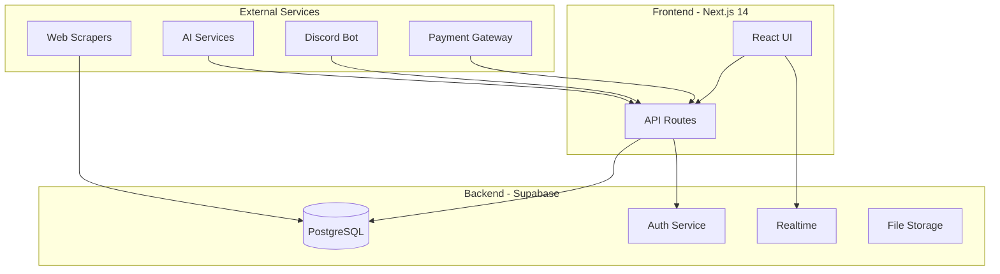
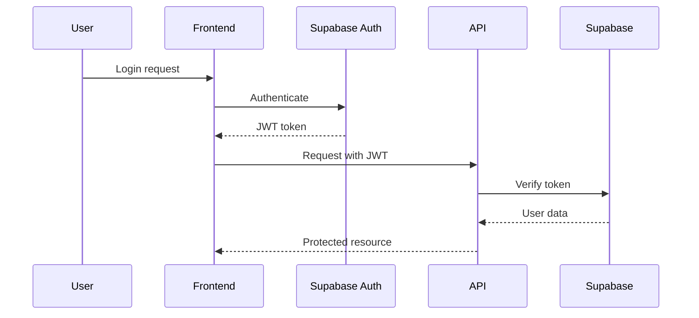

# ARCHITECTURE.md - System Architecture & Technical Design

## System Overview



## Database Design

### Core Tables

```sql
-- Users and Authentication
CREATE TABLE users (
    id UUID PRIMARY KEY DEFAULT gen_random_uuid(),
    email TEXT UNIQUE NOT NULL,
    name TEXT,
    password_hash TEXT NOT NULL,
    home_city TEXT,
    subscription_tier TEXT DEFAULT 'freemium',
    subscription_expires_at TIMESTAMP,
    total_spent DECIMAL DEFAULT 0,
    total_profit DECIMAL DEFAULT 0,
    created_at TIMESTAMP DEFAULT NOW(),
    updated_at TIMESTAMP DEFAULT NOW()
);

-- Price Database (CRITICAL - Must have 50k+ records)
CREATE TABLE product_prices (
    id UUID PRIMARY KEY DEFAULT gen_random_uuid(),
    product_name TEXT NOT NULL,
    normalized_name TEXT NOT NULL, -- For matching
    category TEXT NOT NULL,
    subcategory TEXT,
    brand TEXT,
    model TEXT,
    platform TEXT NOT NULL,
    price DECIMAL NOT NULL,
    condition TEXT,
    location TEXT,
    sold_date TIMESTAMP,
    listing_url TEXT,
    shipping_cost DECIMAL,
    bid_count INTEGER,
    seller_rating DECIMAL,
    images JSONB,
    metadata JSONB,
    scraped_at TIMESTAMP DEFAULT NOW(),

    -- Indexes for performance
    INDEX idx_normalized_name (normalized_name),
    INDEX idx_category (category),
    INDEX idx_sold_date (sold_date DESC),
    INDEX idx_platform (platform)
);

-- Price Statistics (Cached calculations)
CREATE TABLE price_statistics (
    id UUID PRIMARY KEY DEFAULT gen_random_uuid(),
    product_name TEXT UNIQUE NOT NULL,
    category TEXT NOT NULL,
    sample_size INTEGER NOT NULL,
    avg_price DECIMAL NOT NULL,
    median_price DECIMAL NOT NULL,
    min_price DECIMAL NOT NULL,
    max_price DECIMAL NOT NULL,
    std_deviation DECIMAL NOT NULL,
    percentile_25 DECIMAL,
    percentile_75 DECIMAL,
    confidence_score DECIMAL NOT NULL, -- 0-1
    last_updated TIMESTAMP DEFAULT NOW(),

    INDEX idx_product_stats (product_name),
    INDEX idx_confidence (confidence_score DESC)
);

-- Active Listings
CREATE TABLE listings (
    id UUID PRIMARY KEY DEFAULT gen_random_uuid(),
    platform TEXT NOT NULL,
    external_id TEXT NOT NULL,
    url TEXT NOT NULL,
    title TEXT,
    normalized_title TEXT,
    price DECIMAL NOT NULL,
    shipping_price DECIMAL,
    condition TEXT,
    category TEXT,
    location TEXT,
    seller_info JSONB,
    images JSONB,
    description TEXT,

    -- Profit calculations
    market_value DECIMAL,
    expected_profit DECIMAL,
    profit_confidence DECIMAL,
    profit_percentage DECIMAL,

    -- Auction specific
    is_auction BOOLEAN DEFAULT FALSE,
    auction_ends_at TIMESTAMP,
    current_bids INTEGER,

    -- Status tracking
    status TEXT DEFAULT 'active', -- active, sold, expired, hidden
    locked_by_gold BOOLEAN DEFAULT FALSE,
    created_at TIMESTAMP DEFAULT NOW(),
    updated_at TIMESTAMP DEFAULT NOW(),

    UNIQUE(platform, external_id),
    INDEX idx_category_listing (category),
    INDEX idx_profit (expected_profit DESC),
    INDEX idx_created (created_at DESC)
);

-- Notifications and Unlocks
CREATE TABLE notifications (
    id UUID PRIMARY KEY DEFAULT gen_random_uuid(),
    listing_id UUID REFERENCES listings(id) ON DELETE CASCADE,
    user_id UUID REFERENCES users(id) ON DELETE CASCADE,
    user_tier TEXT NOT NULL,

    -- Notification status
    sent_at TIMESTAMP DEFAULT NOW(),
    viewed_at TIMESTAMP,
    unlocked BOOLEAN DEFAULT FALSE,
    unlocked_at TIMESTAMP,

    -- Unlock details
    unlock_price DECIMAL,
    unlock_counter INTEGER DEFAULT 0,

    -- Hierarchical access control
    hidden BOOLEAN DEFAULT FALSE, -- Hidden by higher tier
    access_preserved BOOLEAN DEFAULT FALSE, -- Keeps access despite hierarchy

    -- Performance
    INDEX idx_user_notifications (user_id, sent_at DESC),
    INDEX idx_listing_unlocks (listing_id, unlocked),
    UNIQUE(listing_id, user_id)
);

-- Transactions
CREATE TABLE transactions (
    id UUID PRIMARY KEY DEFAULT gen_random_uuid(),
    user_id UUID REFERENCES users(id),
    type TEXT NOT NULL, -- unlock, subscription, refund
    amount DECIMAL NOT NULL,
    currency TEXT DEFAULT 'SEK',
    status TEXT DEFAULT 'pending', -- pending, completed, failed, refunded

    -- Reference data
    listing_id UUID REFERENCES listings(id),
    notification_id UUID REFERENCES notifications(id),

    -- Payment details
    payment_method TEXT, -- swish, card, mock
    payment_reference TEXT,

    created_at TIMESTAMP DEFAULT NOW(),
    completed_at TIMESTAMP,

    INDEX idx_user_transactions (user_id, created_at DESC),
    INDEX idx_status (status)
);

-- User Niches
CREATE TABLE user_niches (
    user_id UUID REFERENCES users(id) ON DELETE CASCADE,
    niche TEXT NOT NULL,
    priority INTEGER DEFAULT 1,
    created_at TIMESTAMP DEFAULT NOW(),

    PRIMARY KEY (user_id, niche),
    INDEX idx_niche (niche)
);

-- FlipSquads (Gold feature)
CREATE TABLE flipsquads (
    id UUID PRIMARY KEY DEFAULT gen_random_uuid(),
    name TEXT NOT NULL,
    creator_id UUID REFERENCES users(id),
    city TEXT,
    niche TEXT,
    capital_requirement DECIMAL,
    max_members INTEGER DEFAULT 4,
    is_recruiting BOOLEAN DEFAULT TRUE,
    total_deals INTEGER DEFAULT 0,
    total_profit DECIMAL DEFAULT 0,
    created_at TIMESTAMP DEFAULT NOW(),

    INDEX idx_recruiting (is_recruiting, city, niche)
);

CREATE TABLE flipsquad_members (
    squad_id UUID REFERENCES flipsquads(id) ON DELETE CASCADE,
    user_id UUID REFERENCES users(id) ON DELETE CASCADE,
    role TEXT DEFAULT 'member', -- creator, member
    profit_share DECIMAL DEFAULT 0.25, -- Default equal split
    joined_at TIMESTAMP DEFAULT NOW(),

    PRIMARY KEY (squad_id, user_id)
);

-- User Listings (AutoLister feature)
CREATE TABLE user_listings (
    id UUID PRIMARY KEY DEFAULT gen_random_uuid(),
    user_id UUID REFERENCES users(id),
    title TEXT NOT NULL,
    description TEXT,
    images JSONB,

    -- AI Analysis
    ai_analysis JSONB, -- Product identification, condition, etc
    recommended_prices JSONB, -- Per platform

    -- Listing status
    listed_platforms JSONB, -- Which platforms it's listed on
    status TEXT DEFAULT 'draft', -- draft, active, sold
    auto_price_adjust BOOLEAN DEFAULT FALSE,

    -- Metrics
    total_views INTEGER DEFAULT 0,
    total_inquiries INTEGER DEFAULT 0,

    created_at TIMESTAMP DEFAULT NOW(),
    sold_at TIMESTAMP,
    sold_price DECIMAL,

    INDEX idx_user_listings (user_id, status)
);
```

## API Architecture

### RESTful Endpoints

```typescript
// Authentication
POST   /api/auth/register
POST   /api/auth/login
POST   /api/auth/logout
POST   /api/auth/refresh
POST   /api/auth/reset-password

// Listings & Notifications
GET    /api/listings                 // Active deals
GET    /api/listings/:id             // Single listing details
POST   /api/listings/:id/unlock      // Unlock a listing
GET    /api/notifications            // User notifications
PATCH  /api/notifications/:id/read   // Mark as read

// User Management
GET    /api/users/profile
PATCH  /api/users/profile
GET    /api/users/niches
POST   /api/users/niches
DELETE /api/users/niches/:niche

// Subscriptions
GET    /api/subscriptions/current
POST   /api/subscriptions/upgrade
POST   /api/subscriptions/cancel

// FlipSquad (Gold only)
GET    /api/flipsquads              // Browse squads
POST   /api/flipsquads              // Create squad
GET    /api/flipsquads/:id          // Squad details
POST   /api/flipsquads/:id/join     // Apply to join
POST   /api/flipsquads/:id/messages // Send chat message

// AutoLister (Gold only)
POST   /api/autolister/analyze      // AI analysis
POST   /api/autolister/create       // Create listing
GET    /api/autolister/listings     // User's listings
PATCH  /api/autolister/:id/price    // Update pricing

// Admin (Protected)
GET    /api/admin/stats             // Platform statistics
GET    /api/admin/users             // User management
POST   /api/admin/scrapers/trigger  // Manual scraper control
GET    /api/admin/health            // System health
```

## Service Architecture

### Scraping Service

```typescript
class ScrapingOrchestrator {
  private scrapers: Map<Platform, BaseScraper>;
  private queue: PQueue;
  private rateLimiters: Map<Platform, RateLimiter>;

  async orchestrate() {
    // Phase 1: Price database collection (CRITICAL)
    if (!(await this.isPriceDatabaseComplete())) {
      await this.collectHistoricalPrices();
      return;
    }

    // Phase 2: Active deal hunting
    const userNiches = await this.getUserNiches();
    const tasks = this.createScrapingTasks(userNiches);

    for (const task of tasks) {
      await this.queue.add(async () => {
        await this.rateLimiters.get(task.platform).wait();
        await this.scrapers.get(task.platform).scrape(task);
      });
    }
  }
}
```

### AI Service Architecture

```typescript
class AIService {
  // Development: Free alternatives
  private tensorflowAnalyzer: TensorFlowAnalyzer;
  private ollamaClient: OllamaClient;

  // Production: Paid APIs
  private openaiClient?: OpenAIClient;

  async analyzeProduct(images: string[], description: string) {
    if (process.env.NODE_ENV === 'development') {
      // Use free alternatives during development
      const tfAnalysis = await this.tensorflowAnalyzer.analyze(images);
      const textAnalysis = await this.ollamaClient.analyze(description);
      return this.combineAnalysis(tfAnalysis, textAnalysis);
    }

    // Production: Use OpenAI Vision
    return await this.openaiClient.analyzeWithVision(images, description);
  }

  async calculateProfit(listing: Listing) {
    // ALWAYS use price database
    const priceData = await this.getPriceStatistics(listing);

    if (!priceData || priceData.confidence < 0.6) {
      return { shouldNotify: false, reason: 'Insufficient data' };
    }

    return {
      expectedProfit: priceData.median - listing.price,
      confidence: priceData.confidence,
      shouldNotify: true,
    };
  }
}
```

## Real-time Architecture

### WebSocket Connections

```typescript
// Supabase Realtime Channels
const channels = {
  // User-specific notifications
  userNotifications: (userId: string) => `notifications:${userId}`,

  // FlipSquad chat
  squadChat: (squadId: string) => `squad:${squadId}`,

  // Admin monitoring
  systemHealth: 'admin:health',
  scrapingStatus: 'admin:scrapers',
};

// Client subscription
const subscription = supabase
  .channel(channels.userNotifications(userId))
  .on(
    'postgres_changes',
    {
      event: 'INSERT',
      schema: 'public',
      table: 'notifications',
    },
    handleNewNotification
  )
  .subscribe();
```

## Deployment Architecture

### Environment Progression

```yaml
# Development (Local)
Database: Supabase Free (500MB)
Hosting: Local Next.js dev server
AI: TensorFlow.js / Ollama
Payments: Mock system
Cost: 0 SEK

# Staging (Beta)
Database: Supabase Free
Hosting: Vercel Hobby
AI: Limited OpenAI credits
Payments: Mock system
Cost: ~200 SEK/month

# Production
Database: Supabase Pro ($25)
Hosting: Vercel Pro ($20)
AI: OpenAI API (~$200-500)
Payments: Swish Business
CDN: Cloudflare
Monitoring: Sentry
Cost: ~5000-8000 SEK/month
```

### Infrastructure as Code

```typescript
// vercel.json
{
  "functions": {
    "app/api/scrapers/trigger.ts": {
      "maxDuration": 300  // 5 minutes for scraping
    },
    "app/api/**/*.ts": {
      "maxDuration": 30   // 30 seconds default
    }
  },
  "crons": [{
    "path": "/api/cron/price-update",
    "schedule": "0 3 * * *"  // 3 AM daily
  }]
}
```

## Security Architecture

### Authentication Flow



### Data Encryption

```typescript
class EncryptionService {
  private algorithm = 'aes-256-gcm';

  // User platform credentials
  async encryptCredentials(userId: string, platform: string, creds: any) {
    const key = await this.deriveUserKey(userId, platform);
    const encrypted = await this.encrypt(JSON.stringify(creds), key);
    return encrypted;
  }

  // Sensitive user data
  async encryptPII(data: any) {
    const masterKey = await this.getMasterKey();
    return await this.encrypt(data, masterKey);
  }
}
```

## Performance Optimization

### Caching Strategy

```typescript
const cacheConfig = {
  // Static content
  images: {
    strategy: 'stale-while-revalidate',
    maxAge: 86400, // 24 hours
  },

  // Price statistics
  priceData: {
    strategy: 'cache-first',
    maxAge: 7200, // 2 hours
    staleTime: 3600, // 1 hour
  },

  // User data
  profile: {
    strategy: 'network-first',
    maxAge: 300, // 5 minutes
  },

  // Real-time data
  notifications: {
    strategy: 'network-only', // Always fresh
  },
};
```

### Database Optimization

```sql
-- Materialized views for statistics
CREATE MATERIALIZED VIEW mv_price_stats AS
SELECT
    product_name,
    category,
    COUNT(*) as sample_size,
    AVG(price) as avg_price,
    PERCENTILE_CONT(0.5) WITHIN GROUP (ORDER BY price) as median_price,
    MIN(price) as min_price,
    MAX(price) as max_price,
    STDDEV(price) as std_dev
FROM product_prices
WHERE sold_date > NOW() - INTERVAL '90 days'
GROUP BY product_name, category;

-- Refresh daily
CREATE INDEX idx_mv_price_stats ON mv_price_stats(product_name);
REFRESH MATERIALIZED VIEW mv_price_stats;
```

## Monitoring & Observability

### Key Metrics

```typescript
const metrics = {
  // Business metrics
  activeUsers:
    'COUNT(DISTINCT user_id) FROM sessions WHERE last_seen > NOW() - INTERVAL 5 minutes',
  conversionRate: 'COUNT(paid_users) / COUNT(all_users)',
  avgRevenuePerUser: 'SUM(revenue) / COUNT(DISTINCT user_id)',

  // Technical metrics
  apiLatency: 'p50, p95, p99 response times',
  errorRate: 'failed_requests / total_requests',
  scrapingSuccess: 'successful_scrapes / total_attempts',

  // Health indicators
  databaseConnections: 'active / max connections',
  memoryUsage: 'used / allocated',
  diskSpace: 'used / available',
};
```

### Alerting Rules

```yaml
alerts:
  - name: HighErrorRate
    condition: error_rate > 0.05
    severity: critical
    action: page_on_call

  - name: ScraperBlocked
    condition: scraping_success_rate < 0.5
    severity: high
    action: notify_admin

  - name: LowPriceData
    condition: price_database_size < 40000
    severity: critical
    action: block_notifications

  - name: PaymentFailure
    condition: payment_success_rate < 0.95
    severity: high
    action: notify_finance
```

## Disaster Recovery

### Backup Strategy

```bash
# Database backups
- Daily full backup (retained 30 days)
- Hourly incremental (retained 7 days)
- Point-in-time recovery (last 7 days)

# Code backups
- Git repository (GitHub)
- Tagged releases
- Environment configs in secure vault

# Data recovery priorities
1. User accounts and subscriptions
2. Price database
3. Active listings
4. Transaction history
5. User-generated content
```

### Failure Scenarios

```typescript
const failureHandlers = {
  databaseDown: async () => {
    // Switch to read-only mode
    // Serve cached content
    // Queue writes for replay
  },

  scrapersBlocked: async () => {
    // Rotate proxy pool
    // Reduce scraping rate
    // Alert admin for manual intervention
  },

  paymentGatewayDown: async () => {
    // Queue transactions
    // Send manual payment instructions
    // Process bulk when restored
  },

  aiServiceDown: async () => {
    // Fall back to basic profit calculation
    // Use cached AI results
    // Reduce feature set temporarily
  },
};
```

Remember: The architecture must support rapid iteration during development while being ready to scale for production. Always prioritize the price database integrity above all else.
